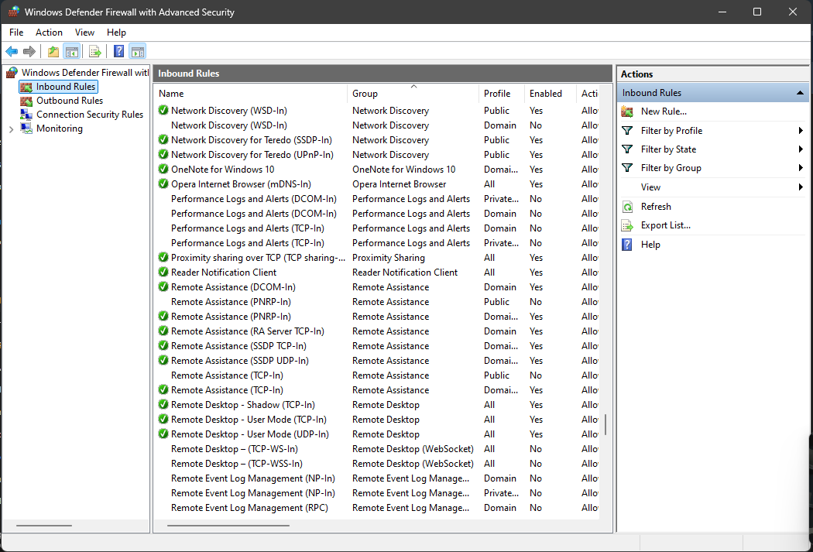
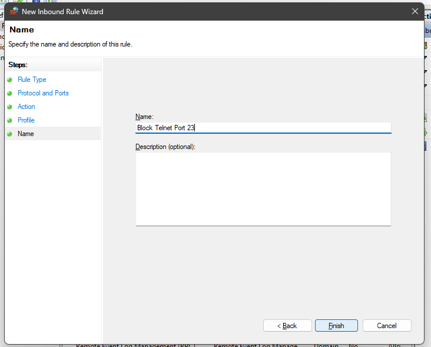
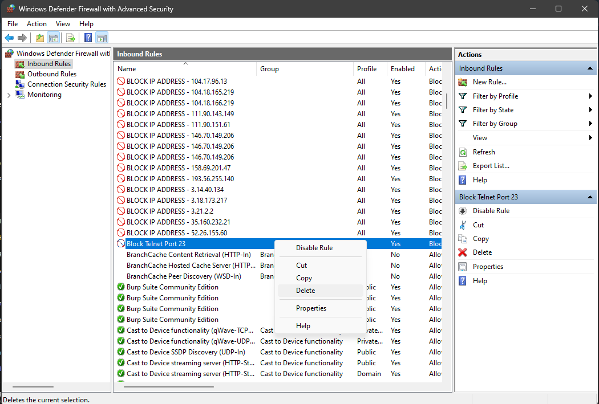
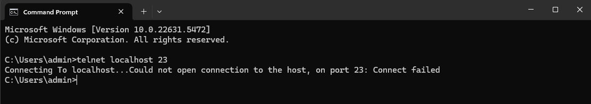

# 🔐 Cyber Security Internship - Task 4: Firewall Configuration (Windows)

## 🎯 Objective

Configure and test basic firewall rules on **Windows** using **Windows Defender Firewall with Advanced Security** to allow or block traffic.

---

## 💻 Operating System

* Windows 10 / 11

---

## 🛠️ Tools Used

* Windows Defender Firewall (GUI)
* Telnet Client (optional, for testing)

---

## 📌 Task Steps

### 1. ✅ **View Existing Firewall Rules**

* Open **"Control Panel → Windows Defender Firewall → Windows Defender Firewall with Advanced Security"**
* Navigate to **Inbound Rules** and **Outbound Rules** to view the list of active rules.

---

### 2. ❌ **Block Inbound Traffic on Port 23 (Telnet)**

* In **Inbound Rules** → Click **New Rule...**

  * Rule Type: **Port**
  * Protocol: **TCP**
  * Specific local ports: `23`
  * Action: **Block the connection**
  * Profile: **Domain, Private, Public**
  * Name: `Block Telnet Port 23`

---

### 3. 🧪 **Test the Rule**

* Enable **Telnet Client** (if not already enabled):

  * Control Panel → Programs → Turn Windows features on or off → Check **Telnet Client**
* Open **Command Prompt**:

```
telnet localhost 23
```

* ✅ **Expected Output**:

  ```
  Connecting To localhost...Could not open connection to the host, on port 23: Connect failed
  ```

---

### 4. 🔓 **Allow Inbound Traffic on Port 22 (SSH)**

* In **Inbound Rules** → Click **New Rule...**

  * Rule Type: **Port**
  * Protocol: **TCP**
  * Port: `22`
  * Action: **Allow the connection**
  * Name: `Allow SSH Port 22`

---

### 5. ♻️ **Remove the Test Rule**

* Go to **Inbound Rules**
* Find `Block Telnet Port 23`
* Right-click → **Delete**

---

📷 Screenshots

Below are the screenshots demonstrating each step.

🔹 Current Firewall Rules



🔹 Rule Created to Block Port 23



🔹 Telnet Test (Before and After Blocking)



🔹 Rule Deletion Confirmation


---

## 📄 Summary

In this task, we configured Windows Firewall to:

* Block Telnet traffic (port 23)
* Allow SSH traffic (port 22)
* Verified these rules using Telnet
* Cleaned up test rules to restore original state

This demonstrates understanding of basic firewall rule configuration on Windows.
